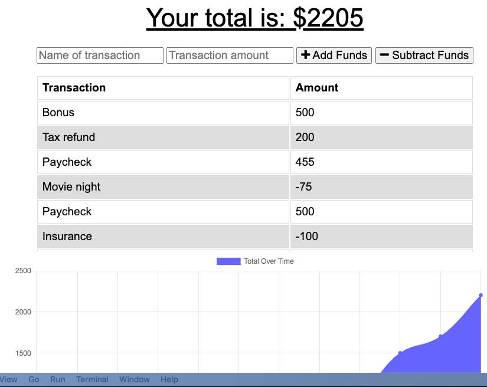

# Budget tracker progressive weg application

This application is designed to give users basic operability, even when they do not have an internet connection.

## Installation/Usage

To access the application, simply go to https://calm-falls-58509.herokuapp.com.

## Functionality

Upon load the page displays a budget and gives users the opportunity to add funds or expenses. Using indexedDB, the application gives users those same capabilities even if the user is offline.

## Technologies

This application uses JS for its main logic. It also uses HTML and CSS, along with bootstrap. Data is stored using mongo. The application also uses mongoose and express as well as the previously mentioned indexedDB.
